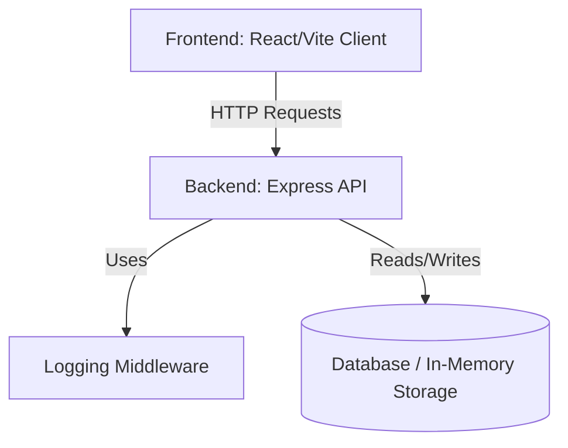

# Notification System Design

## Architecture Overview

The Notification System is designed to handle sending and managing notifications for users in a scalable and robust way. The architecture is primarily divided into a frontend client, a backend API service, and a custom logging middleware.



## Components

### 1. Frontend Client (`notification_app_fe`)
*   **Tech Stack:** React, Vite, CSS
*   **Purpose:** Provides a user interface to display notifications and trigger new ones. It polls or connects via WebSockets (if real-time is required) to fetch new notifications.
*   **Features:**
    *   Dashboard to view incoming notifications.
    *   Form to trigger a notification to a specific user.
    *   Mark as read functionality.

### 2. Backend Service (`notification_app_be`)
*   **Tech Stack:** Node.js, Express.js
*   **Purpose:** Serves as the core API that manages notification state.
*   **Key Endpoints:**
    *   `GET /api/notifications` - Retrieve list of notifications.
    *   `POST /api/notifications` - Create and send a new notification.
    *   `PATCH /api/notifications/:id/read` - Mark a specific notification as read.

### 3. Logging Middleware (`logging_middleware`)
*   **Tech Stack:** Node.js
*   **Purpose:** An independent, reusable Express middleware module responsible for intercepting incoming HTTP requests and outgoing responses.
*   **Features:**
    *   Logs request Method, URL, Body, and Timestamp.
    *   Logs response Status Code and execution time.
    *   Handles errors and logs stack traces.

## Data Model

A simple notification record structure:
```json
{
  "id": "uuid",
  "userId": "string",
  "title": "string",
  "message": "string",
  "isRead": false,
  "createdAt": "timestamp"
}
```

## Future Scalability
For production, the system can be enhanced with:
1.  **Message Queue (e.g., RabbitMQ, Kafka):** To handle high throughput of incoming notifications asynchronously.
2.  **WebSockets (e.g., Socket.io):** To push real-time updates to the frontend client without polling.
3.  **Push Notification Service:** Integration with FCM (Firebase Cloud Messaging) or APNs for mobile push support.
